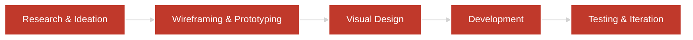

## About Me

I'm a full-stack web developer with a strong focus on UI/UX design. I work across the entire product development cycle from user research and wireframing to building scalable applications with clean, maintainable code.

My approach combines design thinking with technical execution. I prioritize accessibility, responsive design, and user experience in everything I build.

### My Development Process

## Tech Stack

<table>
  <tr>
    <td><strong>Languages</strong></td>
    <td>
      
      
      
      
    </td>
  </tr>
  <tr>
    <td><strong>Frontend</strong></td>
    <td>
      
      
      
      
      
    </td>
  </tr>
  <tr>
    <td><strong>Backend & APIs</strong></td>
    <td>
      
      
      
      
    </td>
  </tr>
  <tr>
    <td><strong>Databases</strong></td>
    <td>
      
      
      
    </td>
  </tr>
  <tr>
    <td><strong>Design Tools</strong></td>
    <td>
      
      
      
    </td>
  </tr>
  <tr>
    <td><strong>Development Tools</strong></td>
    <td>
      
      
      
      
      
    </td>
  </tr>
  <tr>
    <td><strong>DevOps & Cloud</strong></td>
    <td>
      
      
      
      
    </td>
  </tr>
  <tr>
    <td><strong>Testing & Documentation</strong></td>
    <td>
      
      
      
    </td>
  </tr>
</table>

 

 

